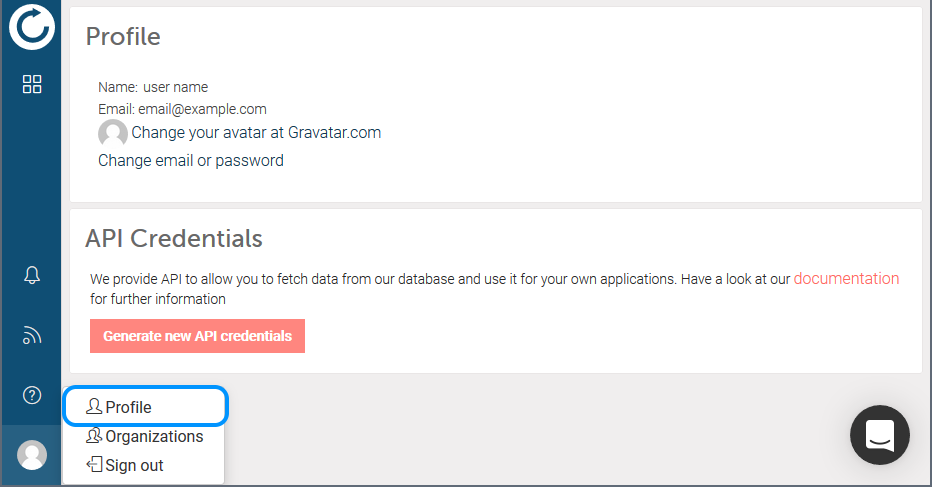
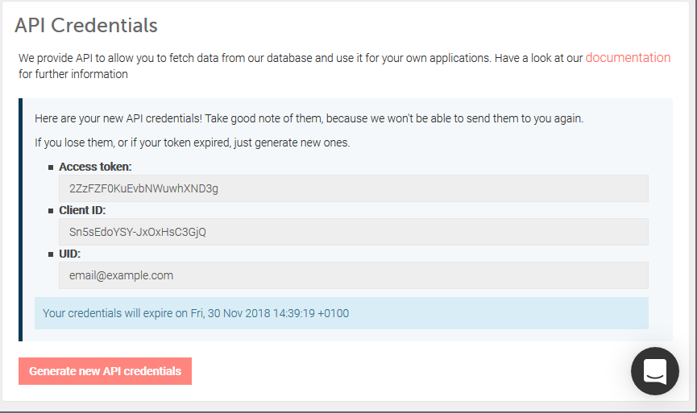
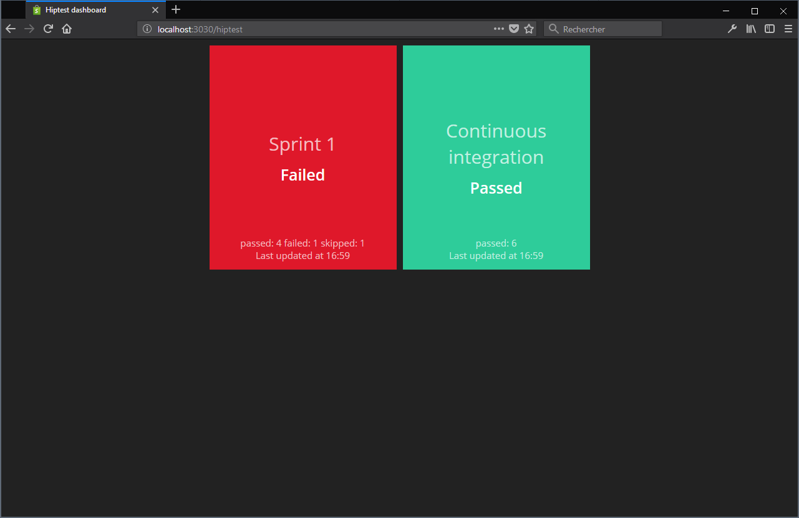

Hiptest API - How to use it and build your dashboard
====================================================

The Hiptest API allows you to build integration with virtually anything.

It is still young and new features are constantly added but you may already get
great benefits from it.

In this tutorial you will have a first look on how to get started before using
it to report statuses of your Hiptest test runs on a dashboard.

## Pre-requisites for this tutorial

To fully understand this tutorial it is better to have some basic knowledge of
HTTP requests, and eventually a tool like CURL to test requests to the API.

For the dashboard part [smashing](https://github.com/Smashing/smashing) will be
used. To test it by yourself, you will need Ruby installed and ready to go on
your computer. If you are not a Ruby developer, don’t worry: there is very
little code and it is really easy to read and to understand.

## Presentation of the API

Hiptest API is RESTFull and follows the [{json:api}](http://jsonapi.org)
specification. Documentation is available at
[hiptest.github.io/slate/](https://hiptest.github.io/slate/).

### Authentication

Before anything else you need to sign into Hiptest and generate your API
credentials. These credentials will be used to authenticate your API requests.
API access is open for all paying plans and open source subscription. If you are
in a free plan and want access to the API, feel free to contact Hiptest support
and we will find a solution for you.

#### Generate credentials using Hiptest UI

You can easily generate your credentials on Hiptest.net. Sign-in to your account
then go to your profile page. Click the `Generate new API credentials` button.





#### Sign-in and generate credentials using Hiptest API

It is also possible to sign in and generate API credentials using the API. Post
your email address and your password to `hiptest.net/api/auth/sign_in` as
describe below:

```http
POST https://hiptest.net/api/auth/sign_in HTTP/1.1
Content-Type: application/json

{
  "email": "your_email_address@example.com",
  "password": "your-password"
}
```

An `Access-Token`, `Client` and `UID` will then be part of the response Headers.

To give it a try you can copy/paste the following command into your terminal.
Just use your email address and password instead of
`your_email_address@example.com` and `your-password`:

```sh
curl --header 'Content-Type: application/json' --data '{"email": "your_email_address@example.com", "password": "your-password"}' --dump-header - https://hiptest.net/api/auth/sign_in
```

On Windows you can try the following
[PowerShell](https://docs.microsoft.com/fr-fr/powershell/scripting/getting-started/fundamental/using-windows-powershell?view=powershell-5.1)
command:

```PowerShell
(Invoke-WebRequest -Method Post -Uri 'https://hiptest.net/api/auth/sign_in' -Body '{"email": "your_email_address@example.com", "password": "your-password"}' -Headers @{'Content-Type' = 'application/json'}).Headers
```

Both commands should provide an output similar to the following:

```
Transfer-Encoding: chunked
Connection: keep-alive
X-Request-ID: 76af79ac-bc67-4bd8-ba62-5ecc9d76f0a3
X-Frame-Options: SAMEORIGIN
X-XSS-Protection: 1; mode=block
X-Content-Type-Options: nosniff
access-token: VTyqr_xxx_xxx0KH-YrbQQ
token-type: Bearer
client: cHhNuwROzt_xxxxxsaTPw
expiry: 1543397543
uid: you_email_address@example.com
ETag: W/"3cc40a7a162c1c625b5b826c6fd2d3f8"
Cache-Control: max-age=0, private, must-revalidate
X-Request-Id: 76af79ac-bc67-4bd8-ba62-5ecc9d76f0a3
X-Runtime: 0.390018
Strict-Transport-Security: max-age=31536000
Vary: Accept-Encoding
```

The interesting values here are:
```
access-token: VTyqr_xxx_xxx0KH-YrbQQ
client: cHhNuwROzt_xxxxxsaTPw
uid: you_email_address@example.com
```

If you sign into Hiptest using GitHub or Google and don’t have a password, sign
out and follow the process to reset your password. That way you will be able to
create a password for your account in addition to GitHub or Google.

#### Final notice about the credentials

Your access token is valid for one year. After this period it will be expired
and you will have to generate a new one. More information is available in the
[documentation](https://hiptest.github.io/slate/#renewing-your-api-credentials).

### Requesting the API

Now that you have your API credentials, it is possible to request the API. For
example let’s retrieve your projects list:

```http
GET https://hiptest.net/api/projects HTTP/1.1
Accept: application/vnd.api+json; version=1
access-token: your-access-token
client: you-client-id
uid: your_uid
```

That returns the following JSON:

```json
{
  "data": [
    {
      "type": "projects",
      "id": "61344",
      "attributes": {
        "name": "Testing CASH WITHDRAWAL (sample N°2)"
      },
      "links": {
        "self": "/projects/61344"
      }
    }, {
      "type": "projects",
      "id": "46292",
      "attributes": {
        "name": "Testing BOOKSTORE (sample N°1)"
      }, "links": {
        "self": "/projects/46292"
      }
    }
  ]
}
```

In addition to your API credentials please note the header
`Accept: application/vnd.api+json; version=1`. This one is mandatory for all
requests to the API.

Give it a try! Just replace the API credentials with yours, using curl:

```Sh
curl --header 'Accept: application/vnd.api+json; version=1' --header 'access-token: your-access-token' --header 'client: your-client-id' --header 'uid: your_uid' https://hiptest.net/api/projects
```

or powershell:

```PowerShell
(Invoke-WebRequest -Uri 'https://hiptest.net/api/projects' -Headers @{'Accept' = 'application/vnd.api+json; version=1'; 'access-token' = 'your-access-token'; 'client' = 'you-client-id'; 'uid' = 'your-uid'}).RawContent
```

Now that you know how to request the API to retrieve your projects, you can
request for folders, scenarios, and many other things as described in
[Hiptest REST API documentation](https://hiptest.github.io/slate/).

While building a dashboard you need to know the status of your test runs. Here
is the API endpoint for that purpose:

```http
GET https://hiptest.net/api/projects/[project_id]/test_runs HTTP/1.1
Accept: application/vnd.api+json; version=1
access-token: your-access-token
client: you-client-id
uid: your_uid
```

That returns something like that:

```json
{
  "data": [
    {
      "type": "test-runs",
      "id": "107423",
      "attributes": {
        "created-at": "2017-11-28T11:05:55.806Z",
        "updated-at": "2017-11-28T11:05:56.505Z",
        "last-author": "HiptestBot",
        "name": "Sprint 1",
        "description": "",
        "statuses": {
          "passed": 4,
          "failed": 1,
          "retest": 0,
          "undefined": 0,
          "blocked": 0,
          "skipped": 1,
          "wip": 0
        }
      },
      "links": {
        "self": "/test-runs/107423"
      },
      "relationships": {
        "tags": {}
      }
    },
    {
      "type": "test-runs",
      "id": "107422",
      "attributes": {
        "created-at": "2017-11-28T11:05:53.640Z",
        "updated-at": "2017-11-28T11:05:55.675Z",
        "last-author": "HiptestBot",
        "name": "Continuous integration",
        "description": "",
        "statuses": {
          "passed": 6,
          "failed": 0,
          "retest": 0,
          "undefined": 0,
          "blocked": 0,
          "skipped": 0,
          "wip": 0
        }
      },
      "links": {
        "self": "/test-runs/107422"
      },
      "relationships": {
        "tags": {}
      }
    }
  ],
  "included": []
}
```

Here they are! Statuses for test runs!

TTry this out by replacing [project_id] with the id of one of your projects. Do
not forget to use your API credentials.

Using curl:

```Sh
curl --header 'Accept: application/vnd.api+json; version=1' --header 'access-token: your-access-token' --header 'client: your-client-id' --header 'uid: your_uid' https://hiptest.net/api/projects/[project_id]/test_runs
```

using powershell:

```PowerShell
(Invoke-WebRequest -Uri 'https://hiptest.net/api/projects/[project_id]/test_runs' -Headers @{'Accept' = 'application/vnd.api+json; version=1'; 'access-token' = 'your-access-token'; 'client' = 'you-client-id'; 'uid' = 'your-uid'}).RawContent
```

## The dashboard

Now that you know how to request the Hiptest API to get test runs statuses, you
are all set to build a dashboard.

A dashboard is a control panel which collates information about your product. In
a DevOps context it may display server monitoring data – CPU usage or memory
consumption for example – but also the status of your CI and/or the statuses of
your tests. This is what you will build: a dashboard that permanently shows the
statuses of tests as reported by Hiptest to your team.

Note: the rest of this tutorial assumes that you have Ruby installed and ready
to go.

### Setup your dashboard with smashing

The following command lines will setup smashing, create a new project, and start
it:

```sh
gem install bundler
gem install smashing
smashing new hiptest-api-dashboard-tutorial
cd hiptest-api-dashboard-tutorial
bundle
smashing start
```

If everything worked fine, navigate to http://localhost:3030 to see a sample
dashboard.


If not please consider taking a look on the
[Smashing GitHub project repository](https://github.com/Smashing/smashing).

### Create a dashboard for Hiptest Test runs

First create a new file in the `dashboards` folder named `hiptest.erb`
with the following content:

```erb
<% content_for :title do %>Hiptest dashboard<% end %>
<div class="gridster">
  <ul>
    <li data-row="1" data-col="1" data-sizex="1" data-sizey="1">
      <div data-id="tr-1" data-view="Text" data-title="TR-1" data-text=""></div>
    </li>
    <li data-row="1" data-col="2" data-sizex="1" data-sizey="1">
      <div data-id="tr-2" data-view="Text" data-title="TR-2" data-text=""></div>
    </li>
  </ul>
</div>
```

This creates a new dashboard titled “Hiptest dashboard” with two tiles. Those
tiles will be used to show the status of two test runs for the CASH WITHDRAWAL
sample project.

Navigate to http://localhost:3030/hiptest to see our dashboard:


Now create another file in the `jobs` directory named `hiptest.rb` with the
following content:

```ruby
require 'net/http'
require 'json'

# Set the following constants with your data
PROJECT_ID = 0
ACCESS_TOKEN = 'your-access-token'
CLIENT_ID = 'your-client-id'
UID = 'your-uid'

PROJECT_URL = "https://hiptest.net/api/projects/#{PROJECT_ID}/test_runs"

# That method will actually fetch the data from Hiptest
# and return an array of hashes containing test runs names and statuses
def request_hiptest_status

  uri = URI(PROJECT_URL)
  result = Net::HTTP.start(uri.host, uri.port, use_ssl: uri.scheme == 'https') do |http|
    request = Net::HTTP::Get.new uri
    request['Accept'] = "application/vnd.api+json; version=1"
    request['access-token'] = ACCESS_TOKEN
    request['client'] = CLIENT_ID
    request['uid'] = UID
    http.request request
  end

  if result and result.is_a?(Net::HTTPOK)
    response = JSON.parse(result.body)

    # To return an array containing only names and statusese of test runs
    return response['data'].collect do |test_run|
      {
        'name' => test_run['attributes']['name'],
        'statuses' => test_run['attributes']['statuses']
      }
    end
  end

  # If something wrong happened then tiles won't be refreshed.
  puts 'An error occurs.'
  puts result
end

# This method is in charge of returning the most
# valuable status for the given statuses.
#
# It's up to you to define here which status you want your
# dashboard to show depending the statuses of a test run
def get_status_text(statuses)

  return "Failed" if statuses['failed'] > 0
  return "Blocked" if statuses['blocked'] > 0
  return "Skipped" if statuses['skipped'] > 0
  return "Work in progress" if statuses['wip'] > 0 || statuses['undefined'] > 0
  return "Retest" if statuses['retest'] > 0
  return "Passed" if statuses['passed'] > 0

  return "Unknown"

end

# This will simply concatenate the statuses
# into a single string
def get_status_details(statuses)
  return statuses.map { |key, value|
    "#{key}: #{value}" if value > 0
  }.join(' ')
end

# Every 30 seconds the dashboard will fetch statuses from Hiptest
# then refresh the tiles accordingly
SCHEDULER.every '30s' do
  test_runs = request_hiptest_status

  if test_runs
    send_event('tr-1',
      title: test_runs.first['name'],
      text: get_status_text(test_runs.first['statuses']),
      moreinfo: get_status_details(test_runs.first['statuses']))

    send_event('tr-2',
      title: test_runs.last['name'],
      text: get_status_text(test_runs.last['statuses']),
      moreinfo: get_status_details(test_runs.last['statuses']))
  end
end
```

This code requests the API for test runs statuses then refreshes the tiles
accordingly.

If you stop the dashboard, start it again, and wait for the tiles to be
refreshed, they will look like this:


### Add some colors to the dashboard

The dashboard would be more informative with different colors for each status.
To do so a new widget must be created. Create a new directory in the `widgets`
folder named `status`. Create a new file `status.html` with that content:

```html
<h1 class="title" data-bind="title"></h1>

<h3 data-bind="text"></h3>

<p class="more-info" data-bind="moreinfo"></p>

<p class="updated-at" data-bind="updatedAtMessage"></p>
```

Create a file `status.scss` with that content:

```scss
// ----------------------------------------------------------------------------
// Sass declarations
// ----------------------------------------------------------------------------
$passed-color:      #2ECC9A;
$failed-color:      #DF182A;
$wip-color:         #FFC300;
$blocked-color:     #8B0000;
$retest-color:      #FF7603;
$skipped-color:     #455982;

$background-color:  #8A8A8A;

$title-color:       rgba(255, 255, 255, 0.7);
$moreinfo-color:    rgba(255, 255, 255, 0.7);

// ----------------------------------------------------------------------------
// Widget-status styles
// ----------------------------------------------------------------------------
.widget-status {

  background-color: $background-color;

  .title {
    color: $title-color;
  }

  .more-info {
    color: $moreinfo-color;
  }

  .updated-at {
    color: rgba(255, 255, 255, 0.7);
  }


  &.large h3 {
    font-size: 65px;
  }

  &.status-passed {
    background-color: $passed-color;
  }

  &.status-failed {
    background-color: $failed-color;
  }

  &.status-wip {
    background-color: $wip-color;
  }

  &.status-blocked {
    background-color: $blocked-color;
  }

  &.status-retest {
    background-color: $retest-color;
  }

  &.status-skipped {
    background-color: $skipped-color;
  }
}
```

And a file `status.coffee` with that content:

```coffee
class Dashing.Status extends Dashing.Widget
  onData: (data) ->
    if data.text
      className = ""
      switch data.text.toLowerCase()
        when "passed" then className = "passed"
        when "failed" then className = "failed"
        when "work in progress" then className = "wip"
        when "blocked" then className = "blocked"
        when "retest" then className = "retest"
        when "skipped" then className = "skipped"

      $(@get('node')).attr 'class', (i, c) ->
        c.replace /\bstatus-\$+/g, ''

      $(@get('node')).addClass "status-#{className}"
```

Finally update `dashboards/hiptest.erb` to use the new widget instead of the
`Text` one:

```erb
<% content_for :title do %>Hiptest dashboard<% end %>
<div class="gridster">
  <ul>
    <li data-row="1" data-col="1" data-sizex="1" data-sizey="1">
      <div data-id="tr-1" data-view="Status" data-title="TR-1" data-text=""></div>
    </li>
    <li data-row="1" data-col="2" data-sizex="1" data-sizey="1">
      <div data-id="tr-2" data-view="Status" data-title="TR-2" data-text=""></div>
    </li>
  </ul>
</div>
```

Restart your dashboard and refresh your browser to get your shiny dashboard:



That’s it! Your dashboard now shows you the statuses of your test runs!

## Final words and conclusion

Hiptest API may help you to do much more than reporting statuses of your test
runs on a dashboard. All endpoints are listed in the
[API documentation](https://hiptest.github.io/slate/). Share with us your
Hiptest API usage on [Hiptest User Group](https://answers.hiptest.net/)!

You can also take a look on
[our Trello Backlog](https://trello.com/b/sSdBSlL0/cooking-up-for-the-coming-months)
to see what is planned to be done in the coming months. If something seems to be
missing for you feel free to send us a feature request, still on
[Hiptest User Group](https://answers.hiptest.net/) ;)
