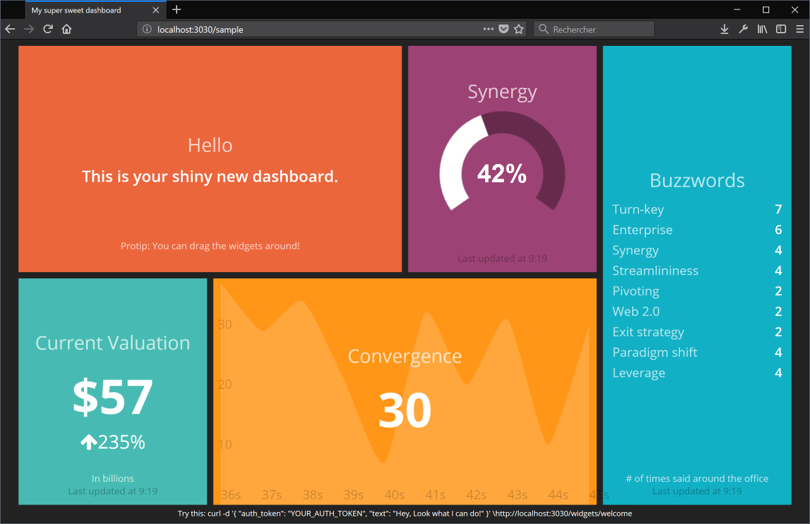
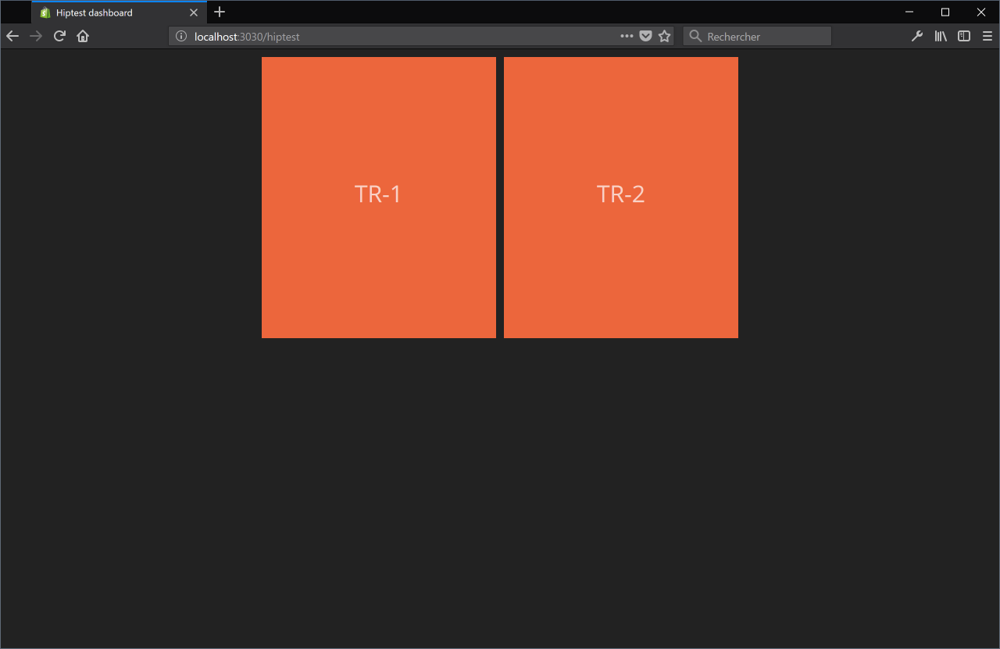
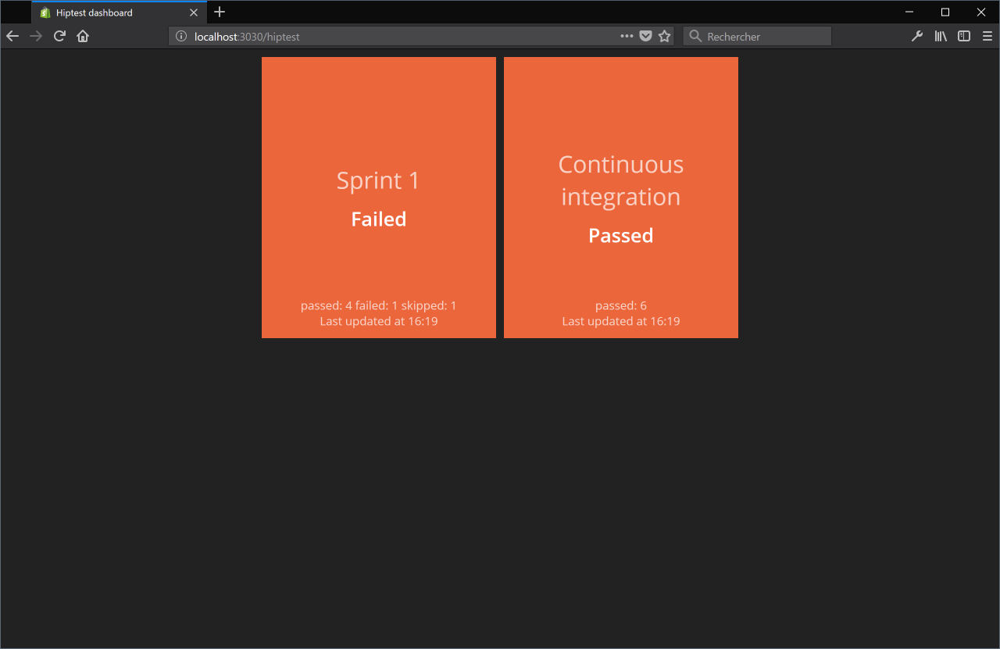

Hiptest API - How to use it for your dashboard
==============================================

The Hiptest API allows you to build integration with virtually anything.

It is still young and we constantly add new features, but you may
already benefit greatly of it.

In this tutorial we will take a first look on how to get started
before trying to use it to report statuses of test runs on a dashboard.

## Pre-requisites for this tutorial

To fully understand this tutorial it is better to have some basic knowledge
on HTTP requests, and eventually a tool like CURL to be able to request the
API for test purpose.

For the dashboard part we will use [smashing](https://github.com/Smashing/smashing).
If you want to test it by yourself you'll need Ruby to be installed and ready
to go on your computer. If you're not a Ruby developer don't worry: there is
very little code and it is really easy to read and to understand.

## Presentation of the API

Hiptest API is RESTFull. We try to follow the [{json:api}](http://jsonapi.org)
specification. The documentation is available at
[hiptest.github.io/slate/](https://hiptest.github.io/slate/).

### Authentication

Before anything else we'll need to authenticate and to generate credentials
to be able to use the API. However it is not available to free, non open-source
subscription. If you would like to test it but only benefit from a free pack
you can eventually create a new account to benefit of a 30 days trial period.

#### Generate credentials using Hiptest UI

You can easily generate your credentials on Hiptest.net. Sign-in to your account
then go to your profile page. Click the `Generate new API credentials` button.


#### Sign-in and generate credentials using Hiptest API

It is also possible to sign-in and generate API credentials using the API.
Simply post your email address and your password to `hiptest.net/api/auth/sign_in`
as describe below:

```http
POST https://hiptest.net/api/auth/sign_in HTTP/1.1
Content-Type: application/json

{
  "email": "your_email_address@example.com",
  "password": "your-password"
}
```

An `Access-Token`, `Client` and `UID` will then be part of the response Headers.

To give it a try you can copy/paste the following command into your Mac OS terminal
or *nix shell. Just use your email address and password instead of
`your_email_address@example.com` and `your-password`:

```sh
curl --header 'Content-Type: application/json' --data '{"email": "your_email_address@example.com", "password": "your-password"}' --dump-header - https://hiptest.net/api/auth/sign_in
```

On Windows you can try the following [PowerShell](https://docs.microsoft.com/fr-fr/powershell/scripting/getting-started/fundamental/using-windows-powershell?view=powershell-5.1) command:

```PowerShell
(Invoke-WebRequest -Method Post -Uri 'https://hiptest.net/api/auth/sign_in' -Body '{"email": "your_email_address@example.com", "password": "your-password"}' -Headers @{'Content-Type' = 'application/json'}).Headers
```

Both commands should return something like that:

```
Transfer-Encoding: chunked
Connection: keep-alive
X-Request-ID: 76af79ac-bc67-4bd8-ba62-5ecc9d76f0a3
X-Frame-Options: SAMEORIGIN
X-XSS-Protection: 1; mode=block
X-Content-Type-Options: nosniff
access-token: VTyqr_xxx_xxx0KH-YrbQQ
token-type: Bearer
client: cHhNuwROzt_xxxxxsaTPw
expiry: 1543397543
uid: you_email_address@example.com
ETag: W/"3cc40a7a162c1c625b5b826c6fd2d3f8"
Cache-Control: max-age=0, private, must-revalidate
X-Request-Id: 76af79ac-bc67-4bd8-ba62-5ecc9d76f0a3
X-Runtime: 0.390018
Strict-Transport-Security: max-age=31536000
Vary: Accept-Encoding
```

The interesting values here are:
```
access-token: VTyqr_xxx_xxx0KH-YrbQQ
client: cHhNuwROzt_xxxxxsaTPw
uid: you_email_address@example.com
```

If you sign-in to Hiptest using GitHub or Google and don't have a password
then sign-out Hiptest and follow the process to reset your password. That way
you'll be able to create a password for your account and to sign-in using it
in addition to GitHub or Google.

#### Final notice about the credentials

Your access token has a 1-year expiration date. More info are available
in the [documentation](https://hiptest.github.io/slate/#renewing-your-api-credentials).

### Requesting the API

Now that you have your API credentials it is possible to request the API.
For example let's retrieve our projects list:

```http
GET https://hiptest.net/api/projects HTTP/1.1
Accept: application/vnd.api+json; version=1
access-token: your-access-token
client: you-client-id
uid: your_uid
```

That returns the following JSON:

```json
{
  "data": [
    {
      "type": "projects",
      "id": "61344",
      "attributes": {
        "name": "Testing CASH WITHDRAWAL (sample N°2)"
      },
      "links": {
        "self": "/projects/61344"
      }
    }, {
      "type": "projects",
      "id": "46292",
      "attributes": {
        "name": "Testing BOOKSTORE (sample N°1)"
      }, "links": {
        "self": "/projects/46292"
      }
    }
  ]
}
```

In addition to your API credentials please note the header
`Accept: application/vnd.api+json; version=1`. That one is mandatory for
all requests to the API.

Give it a try! Just replace the API credentials with yours:

```Sh
curl --header 'Accept: application/vnd.api+json; version=1' --header 'access-token: your-access-token' --header 'client: your-client-id' --header 'uid: your_uid' https://hiptest.net/api/projects
```

```PowerShell
(Invoke-WebRequest -Uri 'https://hiptest.net/api/projects' -Headers @{'Accept' = 'application/vnd.api+json; version=1'; 'access-token' = 'your-access-token'; 'client' = 'you-client-id'; 'uid' = 'your-uid'}).RawContent
```

Now that we know how to request the API and we can retrieve our projects
it is possible to request for folders, scenarios, and many other things
as describe in our [documentation](https://hiptest.github.io/slate/).

As we try to build a dashboard we need to know the status of our test
runs. Here's the API endpoint for that purpose:

```http
GET https://hiptest.net/api/projects/[project_id]/test_runs HTTP/1.1
Accept: application/vnd.api+json; version=1
access-token: your-access-token
client: you-client-id
uid: your_uid
```

That returns something like that:

```json
{
  "data": [
    {
      "type": "test-runs",
      "id": "107423",
      "attributes": {
        "created-at": "2017-11-28T11:05:55.806Z",
        "updated-at": "2017-11-28T11:05:56.505Z",
        "last-author": "HiptestBot",
        "name": "Sprint 1",
        "description": "",
        "statuses": {
          "passed": 4,
          "failed": 1,
          "retest": 0,
          "undefined": 0,
          "blocked": 0,
          "skipped": 1,
          "wip": 0
        }
      },
      "links": {
        "self": "/test-runs/107423"
      },
      "relationships": {
        "tags": {}
      }
    },
    {
      "type": "test-runs",
      "id": "107422",
      "attributes": {
        "created-at": "2017-11-28T11:05:53.640Z",
        "updated-at": "2017-11-28T11:05:55.675Z",
        "last-author": "HiptestBot",
        "name": "Continuous integration",
        "description": "",
        "statuses": {
          "passed": 6,
          "failed": 0,
          "retest": 0,
          "undefined": 0,
          "blocked": 0,
          "skipped": 0,
          "wip": 0
        }
      },
      "links": {
        "self": "/test-runs/107422"
      },
      "relationships": {
        "tags": {}
      }
    }
  ],
  "included": []
}
```

Here they are! Statuses for our both test runs!

To try it on one of your projects just replace [project_id] with the id of one
of your projects in addition to your API credentials:

```Sh
curl --header 'Accept: application/vnd.api+json; version=1' --header 'access-token: your-access-token' --header 'client: your-client-id' --header 'uid: your_uid' https://hiptest.net/api/projects/[project_id]/test_runs
```

```PowerShell
(Invoke-WebRequest -Uri 'https://hiptest.net/api/projects/[project_id]/test_runs' -Headers @{'Accept' = 'application/vnd.api+json; version=1'; 'access-token' = 'your-access-token'; 'client' = 'you-client-id'; 'uid' = 'your-uid'}).RawContent
```

## The dashboard

Now that we know how to request the API and which endpoint can give
us the statuses of our test runs, we can build our dashboard.

Note: the rest of this tutorial is the same whether your are running
Microsoft Windows, Mac OS or Linux. You just have Ruby and the RubyGem
package manager to be installed.

### Setup your dashboard with smashing

The following command lines will setup smashing, create a new
project, and start it:

```sh
gem install bundler
gem install smashing
smashing new hiptest-api-dashboard-tutorial
cd hiptest-api-dashboard-tutorial
bundle
smashing start
```

If everything worked fine you should now be able to navigate to
http://localhost:3030 and see a sample dashboard.



If not please
consider taking a look on the
[Smashing GitHub project repository](https://github.com/Smashing/smashing).

### Create a dashboard for Hiptest Test runs

First create a new file in the `dashboards` folder named `hiptest.erb`
with the following content:

```erb
<% content_for :title do %>Hiptest dashboard<% end %>
<div class="gridster">
  <ul>
    <li data-row="1" data-col="1" data-sizex="1" data-sizey="1">
      <div data-id="tr-1" data-view="Text" data-title="TR-1" data-text=""></div>
    </li>
    <li data-row="1" data-col="2" data-sizex="1" data-sizey="1">
      <div data-id="tr-2" data-view="Text" data-title="TR-2" data-text=""></div>
    </li>
  </ul>
</div>
```

This create a new dashboard titled "Hiptest dashboard" with two tiles.
Those tiles will show us the status of two test runs for the CASH WITHDRAWAL
sample project.

If you navigate to http://localhost:3030/hiptest that should look like that:



Now create another file in the `jobs` directory named `hiptest.rb`
with the following content:

```ruby
require 'net/http'
require 'json'

# Set the following constants with your data
PROJECT_ID = 0
ACCESS_TOKEN = 'your-access-token'
CLIENT_ID = 'your-client-id'
UID = 'your-uid'

PROJECT_URL = "https://hiptest.net/api/projects/#{PROJECT_ID}/test_runs"

# That method will actually fetch the data from Hiptest
# and return an array of hashes containing test runs names and statuses
def request_hiptest_status

  uri = URI(PROJECT_URL)
  result = Net::HTTP.start(uri.host, uri.port, use_ssl: uri.scheme == 'https') do |http|
    request = Net::HTTP::Get.new uri
    request['Accept'] = "application/vnd.api+json; version=1"
    request['access-token'] = ACCESS_TOKEN
    request['client'] = CLIENT_ID
    request['uid'] = UID
    http.request request
  end

  if result and result.is_a?(Net::HTTPOK)
    response = JSON.parse(result.body)

    # To return an array containing only names and statusese of test runs
    return response['data'].collect do |test_run|
      {
        'name' => test_run['attributes']['name'], 
        'statuses' => test_run['attributes']['statuses']
      }
    end
  end

  # If something wrong happened then tiles won't be refreshed.
  puts 'An error occurs.'
  puts result

  return nil
  
end

# This method is in charge of returning the most
# valuable status for the given statuses.
#
# It's up to you to define here which status you want your
# dashboard to show depending the statuses of a test run
def get_status_text(statuses)

  return "Failed" if statuses['failed'] > 0
  return "Blocked" if statuses['blocked'] > 0
  return "Skipped" if statuses['skipped'] > 0
  return "Work in progress" if statuses['wip'] > 0 || statuses['undefined'] > 0
  return "Retest" if statuses['retest'] > 0
  return "Passed" if statuses['passed'] > 0

  return "Unknown"

end

# This will simply concatenate the statuses
# into a single string
def get_status_details(statuses)

  return statuses.map { |key, value|
    "#{key}: #{value}" if value > 0
  }.join(' ')

end

# Every 30 seconds the dashboard will fetch statuses from Hiptest
# then refresh the tiles accordingly
SCHEDULER.every '30s' do

  test_runs = request_hiptest_status

  unless test_runs.nil?

    send_event(
      'tr-1', 
      { 
        title: test_runs.first['name'], 
        text: get_status_text(test_runs.first['statuses']),
        moreinfo: get_status_details(test_runs.first['statuses'])
      })

    send_event(
      'tr-2', 
      { 
        title: test_runs.last['name'], 
        text: get_status_text(test_runs.last['statuses']),
        moreinfo: get_status_details(test_runs.last['statuses'])
      })

  end

end
```

This code requests the API for test runs statuses then refresh the tiles accordingly.

If you stop the dashboard, start it again, and wait for the tiles to be refreshed,
that should looks like this:



